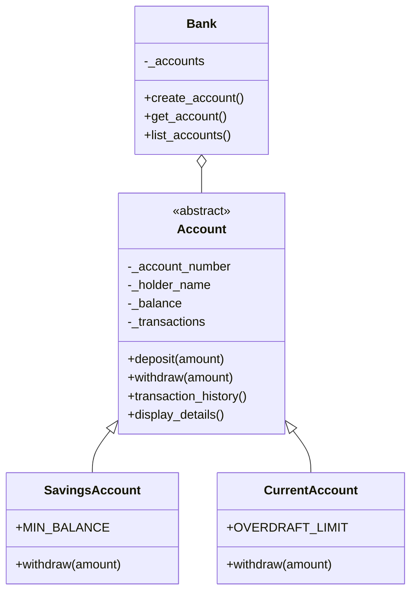

# Banking System Class Diagram

## Architecture

- `Bank` manages accounts.
- `Account` defines common account behavior.
- `SavingsAccount` and `CurrentAccount` implement different withdrawal rules.
- Private attributes beginning with `_` demonstrate encapsulation.
- `Account` is an abstract class, demonstrating abstraction.
- Overridden `withdraw()` methods demonstrate polymorphism.
